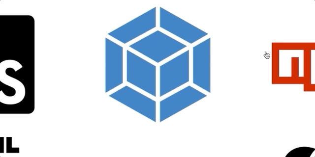

# Shawn Scott's Portfolio Site

## Background & Overview

This is a custom project dedicated to showing off my new and old skills as a Software Engineer. This is more frontend driven, if you are interested in my backend work, please email me at shawn.scott.xd@gmail.com to get behind-the-scenes access to some of my larger projects.

The site is a one page React app that has the feel of 3 pages; a splash page, an about page, and a projects page. 

## Technologies 

`React` / `Webpack` / `HTML` / `CSS` / `JavaScript`

## Splash Component

### Name Animation and Throttling


With the video background, I wanted to have an animation the resembled my name blowing in the wind similiarly to a flag. I found the library Blotter.js that had methods to distort based off sin waves. At times the animation will be very still, and at others it will look like the wind just picked up. This is all do to the wave overlaps and intersections.

I build in a throttling function to rebuild the animation after a user has resized their window. The event is triggered from a window resize and the throttling is there to wait 400 milliseconds after the resize is finished to prevent the function from triggering on every pixel difference. Here is the throttling function;

```javascript

const throttle = (method, scope) => {
    clearTimeout(method._tId);
    method._tId = setTimeout(function(){
        method.call(scope);
    }, 400);
};
        
window.onresize = () => throttle(this.nameAnimation, window);

```

### Video Background

Living in San Francisco bay area is a dream come true. I add this video as a personal touch because the beach has always been a very exciting place for me. This is an html video, muted and looped, scaled to fit the background of the page. 

## Projects Component

### Project Demo by Hover

Upon hovering over a project you will be welcomed with a short demo gif of that project. That is done by changing the extension of that img from png to gif, vice-versa. Here is the code to make that happen.

```javascript

toggleGif(e, ext) {
    let src = e.target.name;
    e.target.src = `assets/${src}${ext}`;
}

componentDidMount() {
    let imgs = document.querySelectorAll("img");
    imgs.forEach(img => {
        img.addEventListener("mouseover", e => this.toggleGif(e, ".gif"));
        img.addEventListener("mouseout", e => this.toggleGif(e, ".png"))
    })
}

```

## About Component

### Parallax Images


These images are set to the background of their div, and made so the background is fixed. This gives that effect that by scrolling you are magically changing the bacground image and everything else is floating over it. Here is the CSS for that.

```css

.pimg {
    position: relative;
    opacity: .7;
    background-position: center;
    background-size: cover;
    background-repeat: no-repeat;
    background-attachment: fixed;
}
.img1 {
    background-image: url('../assets/img1.jpg');
    min-height: 100%;
}
.img2 {
    background-image: url('../assets/img2.jpg');
    min-height: 450px;
}

```

### Skills Text Box Animation



This was done using only a JavaScript 'mouseover' & 'mouseout' eventhandler and the rest was CSS. These little animations are initially set to hidden and the y-location and the opacity are transitioned in over 800 milliseconds upon hover. The translateY transition is set to a cubic-bezier curve which makes it go a little past its spot, then return. Here is the one line of CSS code needed to make all of that happen.

```css

transition: opacity 0.8s, transform 0.6s cubic-bezier(0.61,-0.19, 0.7,-0.11);

```
